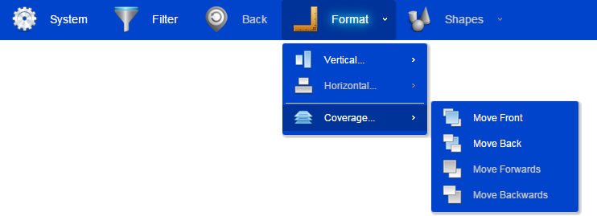

#jquery.navbar.js

## What is it
I think this project is a so pretty jQuery navigation bar plugin, and it supports bootstrap. Lightweight, only 12k compressed. You can refer the demo to use it.  
  
Requires [Easing Plugin](http://gsgd.co.uk/sandbox/jquery/easing/) for Menu Animations.  
  


## Usage
register navigation bar from javascript:  

HTML:
```html  
<div id="nav"></div>
```
JavaScript:
```js 
$("#nav").css("position", "static").navbar({
    skin: "bootstrap",
    // define the elements of the navbar
    menu: [{
        id: "1",
        text: "Foo",
        icon: "images/foo.png",
        action: function( m ) {
            // to do
        }
    }, {
        id: "2",
        text: "Bar",
        icon: "images/bar.png",
        children: [{
            id: "2.1",
            text: "Child",
            icon: "images/child.png",
            action: function( m ) {
                // to do
            }
        }]
    }]
    // there's more, have a look at the demos and options
});
```  
have a look at demos:  
[Bootstrap Style Demo](http://htmlpreview.github.io/?https://github.com/zhaodabao/jquery.navbar.js/master/demo/demo.html)  
[Lightblue Style Demo](http://htmlpreview.github.io/?https://github.com/zhaodabao/jquery.navbar.js/master/demo/demo2.html)

## Options
`menu` - is a array that is the menu of navigation bar.  
*normal menu object attributes:*  
  - `id` - the unique identifies of menu object.
  - `text` - is a string label of menu.
  - `icon` - the icon image of menu object.
  - `disabled` - boolean, be used to define the menu can usable or not.
  - `action` - is a function that is called when a menu is clicked. It is passed a parameter, in order to let you get all the attributes of the menu.
  - `children` - array, be used to define sub menu. The data format as menu.  
  
*separator menu object attribute:*  
  - `separator` - true.

`skin` - we have defined two style for you to use: **bootstrap** and **lightblue**.  
`animation` - is a parameter set that be used to define the animation effects:
  - `blockMove` - the animation effect of primary submenu.
  - `blockMoveDuration` - millisecond, the animation duration of primary submenu.
  - `verticalExpand` - the vertical expand animation effect of secondary submenu.
  - `verticalExpandDuration` - millisecond, the vertical expand animation duration of secondary submenu.
  - `verticalExpandDelay` - millisecond, the vertical expand animation delay of secondary submenu.
  - `verticalCollapse` - the vertical collapse animation effect of secondary submenu.
  - `verticalCollapseDuration` - millisecond, the vertical collapse animation duration of secondary submenu.
  - `verticalCollapseDelay` - millisecond, the vertical collapse animation delay of secondary submenu.
  - `horizontalExpand` - the horizontal expand animation effect of secondary submenu.
  - `horizontalExpandDuration` - millisecond, the horizontal expand animation duration of secondary submenu.
  - `horizontalExpandDelay` - millisecond, the horizontal expand animation delay of secondary submenu.
  - `horizontalCollapse` - the horizontal collapse animation effect of secondary submenu.
  - `horizontalCollapseDuration` - millisecond, the horizontal collapse animation duration of secondary submenu.
  - `horizontalCollapseDelay` - millisecond, the horizontal collapse animation delay of secondary submenu.

## Functions
`destory` - destory the navigation bar.  
`disabled` - change the usable status of the menu. Two parameters, menu's id and new status.  
`text` - change the label of the menu. Two parameters, menu's id and new label text.  
`icon` - change the icon of the menu. Two parameters, menu's id and new image path.

for example:  
```js 
$(document).ready(function() {

    var $nav = $("#nav").css("position", "static").navbar({
        menu: [ // elements of the navbar ]
    });

    $nav.navbar("disabled", "1", true);
    $nav.navbar("text", "1", "HelloWorld");
    $nav.navbar("icon", "1", "images/hello.png");

});
```

## Compatibility
IE 9+, Chrome

## License
jquery.navbar.js is published under the MIT license.
